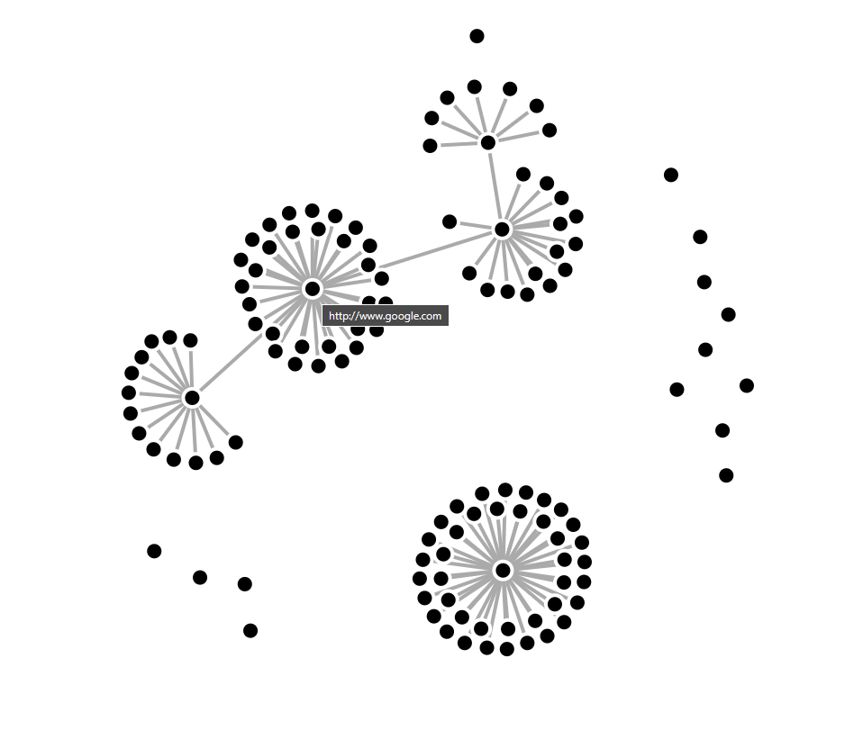

<h1 align="center">
  Page Network Viz (WIP)
</h1>

<h4 align="center">A prototype project to demonstrate Django, d3.js and web scraping(Scrapy) integration. It showcases the space explored by a web crawler.</h4>



<p align="center">
  <a href="https://img.shields.io/badge/Crochet-2.1.1-green">
    
  </a>
  <a href="https://img.shields.io/badge/Django-4.2.7-green">
    
  </a>
  <a href="https://img.shields.io/badge/Scrapy-2.8.0-green">
    
  </a>
  <a href="https://img.shields.io/badge/Redis-7.2.3-green">
    
  </a>
</p>

<p align="center">
  <a href="#features">Features</a> •
  <a href="#how-to-use">How To Use</a> •
  <a href="#download">Download</a> •
  <a href="#credits">Credits</a> •
  <a href="#license">License</a>
</p>

## Features

* Web scraper(Scrapy)
* Network Graph(d3.js)


## How To Use

To clone and run this application, you'll need [Git](https://git-scm.com) and [Python](https://www.python.org/). From your command line:

```bash
# Clone this repository
$ git clone https://github.com/VictorMGon/PageNetwork_viz

# Go into the repository
$ cd PageNetwork_viz

# Setup Redis server
$ ./setup_redis

# Run Redis server
$ ./run_redis

# Install Python dependencies
$ pip install -r requirements.txt

# Initiate Celery worker
$ celery -A crawlerProject worker -P solo

# Make migrations for Django
$ python manage.py makemigrations crawler

# Apply migrations
$ python manage.py migrate

# Create superuser
$ python manage.py createsuperuser

# Run server
$ python manage.py runserver


```

## Download

You can [download](https://www.python.org/downloads/) the latest installable version of Python for Windows, macOS and Linux.

## Credits

This software uses the following open source packages:

- [Python](https://www.python.org/)
- [Django](https://www.djangoproject.com/)
- [Crochet](https://crochet.readthedocs.io/en/stable/index.html)
- [Scrapy](https://scrapy.org/)
- [Redis](https://redis.io/)
- [Celery](https://docs.celeryq.dev/en/stable/index.html)
- [README template](https://www.readme-templates.com/)

## License

MIT

---

> [victormgon.github.io/](https://victormgon.github.io/) &nbsp;&middot;&nbsp;
> GitHub [@VictorMGon](https://github.com/VictorMGon) &nbsp;&middot;&nbsp;

